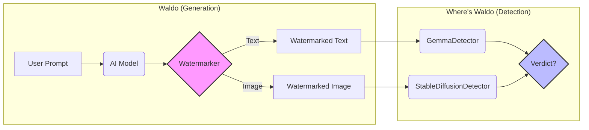

# 🕵️‍♂️ Waldo & Where's Waldo: The Watermarking Library

Welcome to the **Waldo** project! This repository contains a comprehensive suite for **generating** and **detecting** watermarks in AI-generated content.

We split the problem into two distinct packages:

1.  **`waldo`** (The Hider): Models and notebooks for *generating* watermarked text and images.
2.  **`wheres_waldo`** (The Seeker): A lightweight Python package for *detecting* those watermarks.

## 🧠 The Concept

The game is simple: **Waldo** hides a secret signal in the noise of AI outputs, and **Where's Waldo** tries to find it.



## 📂 Structure

- **[`waldo/`](./waldo)**: Contains Jupyter notebooks for running the generation models (Gemma & Stable Diffusion). Perfect for Google Colab.
- **[`wheres_waldo/`](./wheres_waldo)**: A pure Python library containing the detection logic. Can be imported into any Python application.

## 🚀 Quick Start

### 1. Generate Watermarks (`waldo`)
Navigate to the `waldo/` directory and open the notebooks.
- `gemma-2b-2-it.ipynb`: For text generation.
- `stablediffusion-v1-5.ipynb`: For image generation.

### 2. Detect Watermarks (`wheres_waldo`)
Install the package (or just import it) and run detection:

```python
from wheres_waldo import GemmaDetector, StableDiffusionDetector

# Text Detection
detector = GemmaDetector(tokenizer=...)
result = detector.detect("Some suspicious text...")
print(result)

# Image Detection
sd_detector = StableDiffusionDetector()
result = sd_detector.detect(pil_image)
print(result)
```
